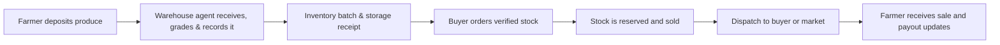

# Kuapa Dwaso

> A warehouse-based produce aggregation platform that helps farmers store produce locally, helps buyers source verified stock, and gives warehouse teams a clear operational record from intake to dispatch.

Kuapa Dwaso is built for a practical problem: farmers should not have to take produce to market without a confirmed buyer, absorb avoidable transport costs, or lose track of what happens after they hand over their harvest. Community warehouses become the trusted point where produce is received, recorded, stored, sold, and dispatched.

## What the platform does

- **Records produce at the warehouse.** Agents register or find farmers, capture quantity, grade, condition, photos, storage terms, and create a traceable inventory batch and receipt.
- **Keeps ownership and availability clear.** Farmers retain ownership while produce is stored. The platform separately tracks received, available, reserved, sold, dispatched, withdrawn, expired, spoiled, and disputed stock.
- **Lets buyers order from verified warehouse inventory.** Buyers can create and follow orders without seeing farmers' private details.
- **Tracks fees, sales, and farmer amounts due.** Storage and other fee rules are recorded against the transaction so historical records remain understandable.
- **Coordinates fulfillment.** Teams can reserve stock, prepare orders, assign dispatches, and follow movement through delivery.
- **Creates an accountable operating record.** Notifications, disputes, evidence, access controls, and audit logs support transparent warehouse operations.



## Who it serves

| Audience         | Experience                                                                                                                                                   |
| ---------------- | ------------------------------------------------------------------------------------------------------------------------------------------------------------ |
| Farmers          | View produce, receipts, fees, sale progress, expected payouts, warehouse contact details, and report issues.                                                 |
| Warehouse agents | Find or register farmers, receive produce, create receipts, manage inventory condition and status, and prepare dispatches.                                   |
| Buyers           | Set up an organization profile, complete verification, browse warehouse availability, place orders, pay, and track fulfillment.                              |
| Transporters     | Maintain a profile, view assigned dispatches, and update delivery progress.                                                                                  |
| Administrators   | Configure the warehouse network and fees; oversee people, inventory, orders, sales, finance, dispatches, disputes, reports, notifications, and audit trails. |

## Product documentation

Start here if you want to understand the product rather than the code:

- [Product guide](docs/product/overview.md) — the problem, operating model, user journeys, features, safeguards, and current scope.
- [Technical overview](docs/technical/architecture.md) — system design, application boundaries, data ownership, integrations, and security model.
- [Documentation index](docs/README.md) — development, deployment, decisions, and historical planning material.

## Repository layout

```text
apps/
  www/       Public marketing and education site
  app/       Farmer, buyer, and transporter self-service app
  ops/       Warehouse-agent operations console
  admin/     Platform administration and oversight console
  api/       NestJS integration and webhook boundary
packages/    Shared UI, domain types, permissions, validators, utilities, and tooling
convex/      Product data model, queries, mutations, and workflows
docs/        Product, technical, deployment, and decision documentation
deploy/      Container and Kubernetes deployment assets
```

## Run locally

### Prerequisites

- Node.js 22 or newer
- Corepack (for the pinned pnpm version)
- A Convex project and Firebase web configuration for the authenticated apps

### Setup

```bash
corepack enable
corepack pnpm install
cp .env.example .env.local
corepack pnpm convex:dev
```

After Convex writes `CONVEX_URL` to `.env.local`, set `NEXT_PUBLIC_CONVEX_URL` to the same value. Add the required Firebase browser configuration and API values to that file; never commit it.

### Start a surface

```bash
corepack pnpm dev:www     # public site: http://localhost:3000
corepack pnpm dev:app     # farmer, buyer, transporter app: http://localhost:3001
corepack pnpm dev:admin   # admin console: http://localhost:3002
corepack pnpm dev:ops     # warehouse operations: http://localhost:3003
corepack pnpm dev:api     # API: http://localhost:4000
```

Useful checks:

```bash
corepack pnpm env:check-next-public
corepack pnpm lint
corepack pnpm typecheck
corepack pnpm test
```

For environment and deployment instructions, see the [deployment runbook](docs/deployment/kubernetes-cloudflare-infisical.md) and the [API README](apps/api/README.md).

## Project status

Kuapa Dwaso is under active development. The repository contains the core warehouse workflow and supporting product surfaces; provider integrations can operate in mock mode for local development. See [current scope and boundaries](docs/product/overview.md#current-scope-and-boundaries) before relying on a capability in production.

## Contributing and security

Before opening a contribution, read the repository conventions in [AGENTS.md](AGENTS.md) and the [documentation index](docs/README.md). Please do not include credentials, farmer data, or other production data in issues, commits, or screenshots.

No open-source license has been selected for this repository yet. Until one is added, do not assume permission to reuse or redistribute the code.
