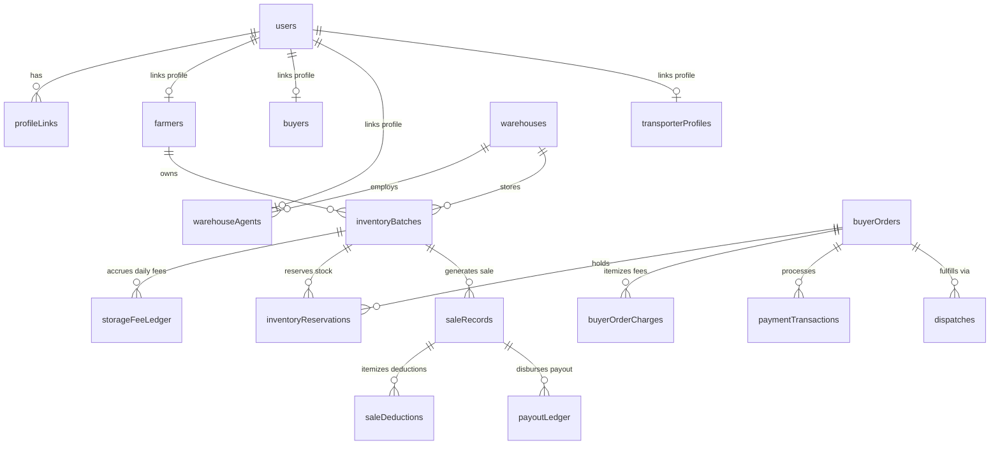
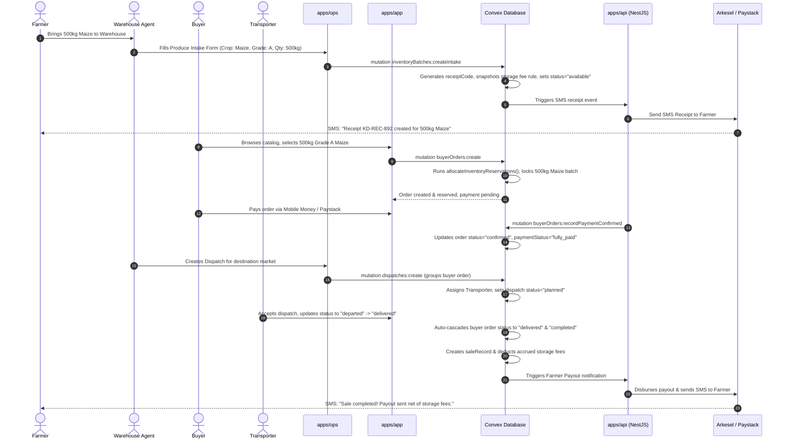

# Kuapa Dwaso: Comprehensive Codebase Architecture, UX Flows & Technical System Specification

## 1. Executive Summary & Core Business Philosophy

**Kuapa Dwaso** is a smartphone-first, warehouse-based produce aggregation platform designed to optimize agricultural trade in low-bandwidth and rural environments. The platform transforms speculative agricultural sales into an organized, accountable warehouse intake process:

1. **Farmer produce deposit**: A farmer deposits produce at a community warehouse.
2. **Intake & Digital Storage Receipt**: A warehouse agent weighs, grades, photographs, and records the produce, issuing a digital storage receipt (`receiptCode`).
3. **Verified Inventory Batch**: An `inventoryBatch` is created in Convex. The farmer retains produce ownership while in storage.
4. **Buyer Ordering**: Buyers browse verified, available warehouse inventory—not private farmer data—and submit orders.
5. **Inventory Allocation & Reservation**: Stock is locked via `inventoryReservations` to eliminate double-selling.
6. **Dispatch & Delivery**: Dispatches aggregate buyer orders into transport loads, tracking movement to destination markets.
7. **Settlement & Deductions**: Post-delivery sale records deduct accrued daily storage fees, handling fees, and transport fees before disbursing farmer payouts.

### Technical Architecture Principles

- **Fixed Top-Level Monorepo Boundaries**: Structured with `apps/`, `packages/`, `convex/`, and `docs/`. Managed with **pnpm** workspaces and **Turborepo**.
- **Convex as Product System of Record**: Convex owns all product state, real-time subscriptions, state transitions, and workflow validations.
- **NestJS API (`apps/api`) as Integration & Webhook Boundary**: Serves as the provider integration bridge for Firebase auth verification, SMS delivery (Arkesel/Mock), Payment processing (Paystack/Mock), Email (Resend/Mock), and Cloudflare R2 private upload URL generation. The API does not store competing business state.
- **Strict Separation of Concerns**: Public marketing site (`apps/www`) is strictly lightweight; operational UI (`apps/ops`, `apps/admin`) and shared UI (`packages/dashboard-ui`) are isolated from client-facing applications (`apps/app`).
- **Low-Bandwidth Bias**: Responsive, lightweight UI components, minimal bundle sizes, offline-tolerant SMS notifications, and real-time reactive Convex updates.

---

## 2. Database Schema (`convex/schema.ts`)

Convex defines the product system of record with strict typing and secondary indexes for real-time querying.



### Table Breakdown

#### Authentication & User Profiles
- **`users`**: Core identity table.
  - Fields: `authUserId` (Firebase UID), `phone`, `email`, `name`, `role` (`farmer`, `warehouse_agent`, `buyer`, `transporter`, `admin`), `status` (`pending`, `active`, `suspended`, `rejected`, `deactivated`), `authMethod` (`phone`, `email_password`, `google`), `mfaRequirement`, `mfaStatus`, `onboardingState`.
  - Indexes: `by_auth_user_id`, `by_phone`, `by_email`, `by_role_status`.
- **`farmers`**: Farmer profile details.
  - Fields: `userId`, `farmerCode`, `name`, `phone`, `community`, `district`, `region`, `preferredLanguage`, `verificationStatus`.
  - Indexes: `by_user`, `by_farmer_code`, `by_phone`, `by_region_district`.
- **`buyers`**: Buyer profile details.
  - Fields: `userId`, `buyerType` (`individual_buyer`, `market_trader`, `processor`, `exporter`, `institution`), `organizationName`, `contactPhone`, `taxId`, `verificationStatus`.
  - Indexes: `by_user`, `by_verification_status`, `by_type`.
- **`transporterProfiles`**: Transporter profiles.
  - Fields: `userId`, `transporterCode`, `name`, `phone`, `vehicleType`, `capacityKg`, `operatingRegions`.
  - Indexes: `by_user`, `by_transporter_code`, `by_phone`.
- **`warehouseAgents`**: Warehouse agent credentials and location bindings.
  - Fields: `userId`, `agentCode`, `name`, `phone`, `warehouseId`, `status`.
  - Indexes: `by_user`, `by_agent_code`, `by_warehouse`.
- **`profileLinks`**: Connects a `user` to a role profile (e.g., matching a newly signed-up phone user with a pre-existing offline farmer profile).
- **`platformInvitations`**: Role onboarding invitations sent via SMS/Email with time-bound tokens.

#### Warehousing & Inventory
- **`warehouses`**: Physical storage hubs.
  - Fields: `name`, `code`, `community`, `district`, `region`, `totalCapacityKg`, `supportedCrops`, `dispatchDays`.
  - Indexes: `by_code`, `by_region_district`.
- **`inventoryBatches`**: Physical produce deposits.
  - Fields: `receiptCode`, `farmerId`, `warehouseId`, `cropType`, `variety`, `grade` (`A`, `B`, `C`, `mixed`, `ungraded`), `quantityReceived`, `quantityAvailable`, `unit`, `storageRateRuleId`, `accruedStorageFees`, `sellByDate`, `status` (`received`, `verified`, `available`, `partially_reserved`, `reserved`, `partially_sold`, `sold`, `prepared_for_dispatch`, `dispatched`, `withdrawn`, `expired`, `spoiled`, `disputed`), `photoStorageIds`.
  - Indexes: `by_receipt_code`, `by_farmer`, `by_warehouse_status`, `by_crop_grade_status`, `by_sell_by_date`.
- **`inventoryReservations`**: Stock holds allocated against buyer orders.
  - Fields: `buyerOrderId`, `inventoryBatchId`, `warehouseId`, `farmerId`, `quantityReserved`, `quantityReleased`, `quantityFulfilled`, `unit`, `expiresAt`, `status` (`active`, `partially_released`, `fulfilled`, `released`, `expired`, `cancelled`).
  - Indexes: `by_order`, `by_batch_status`, `by_status_expires_at`.
- **`storageFeeLedger`**: Daily snapshot of storage fees accrued per batch.
  - Fields: `inventoryBatchId`, `farmerId`, `warehouseId`, `feeDate`, `quantityCharged`, `unit`, `appliedRuleSnapshot`, `amount`, `amountDeducted`, `status`.

#### Orders, Sales & Payments
- **`buyerOrders`**: Commercial purchase orders.
  - Fields: `buyerId`, `destinationMarket`, `cropType`, `requestedQuantity`, `unit`, `preferredGrade`, `matchedInventoryBatchIds`, `subtotalAmount`, `transportFee`, `serviceFee`, `totalAmount`, `paymentStatus` (`awaiting_payment`, `deposit_paid`, `fully_paid`, `refunded`), `status` (`draft`, `submitted`, `awaiting_payment`, `confirmed`, `matched_to_inventory`, `reserved`, `preparing`, `ready_for_dispatch`, `in_transit`, `delivered`, `completed`, `cancelled`, `unfulfilled`, `disputed`).
  - Indexes: `by_buyer`, `by_buyer_status`, `by_status`, `by_payment_status`.
- **`buyerOrderCharges`**: Itemized charges (fees, taxes) attached to an order.
- **`paymentTransactions`**: Gateway payment attempts (Paystack / Mobile Money).
- **`saleRecords`**: Financial breakdown of completed sales per batch/farmer.
- **`saleDeductions`**: Deductions from sale revenue (accrued storage fees, handling, platform commission).
- **`payoutLedger`**: Net farmer payouts.

#### Logistics & Operations
- **`dispatches`**: Consolidated transport dispatches grouping multiple buyer orders.
  - Fields: `dispatchCode`, `originWarehouseId`, `destinationLocation`, `transporterId`, `driverName`, `driverPhone`, `vehicleRegistration`, `buyerOrderIds`, `status` (`planned`, `loading`, `departed`, `in_transit`, `arrived`, `delivered`, `closed`, `cancelled`, `issue_reported`), `dispatchCost`, `costPayer`.
  - Indexes: `by_dispatch_code`, `by_warehouse_status`, `by_transporter_status`.
- **`auditLogs`**: Append-only audit entries storing `actorId`, `actorRole`, `action`, `entityType`, `entityId`, `before` state snapshot, and `after` state snapshot.
- **`disputes`**: Exception management tickets.
- **`notifications` & `smsDeliveries`**: In-app and outbound SMS notification logs.
- **`adminRole`, `adminScope`, `adminAccessGroup`, `adminGroupMembership`**: Platform governance granular RBAC model.

---

## 3. Core Backend Logic & Workflow Engine (`convex/*.ts`)

### `auth.ts` & `adminAccess.ts`
- **Principal Resolution**: Resolves the authenticated Firebase user token to a Convex principal, loading role-specific profiles (`farmer`, `buyer`, `transporter`, `warehouse_agent`, `admin`).
- **Granular Admin RBAC**: Supports role keys (`platform_owner`, `operations_manager`, `warehouse_manager`, `finance_manager`, `support_officer`, `auditor`, `analyst`, `admin_viewer`) scoped by global, warehouse, or regional boundaries.

### `inventoryBatches.ts`
- **Intake Flow (`createIntake`)**:
  1. Validates that the actor is an assigned `warehouse_agent` or `admin`.
  2. Generates a unique digital receipt code (e.g., `KD-REC-2026-X892`).
  3. Selects active storage rate rules for the crop/warehouse and snapshots them into the batch.
  4. Inserts the `inventoryBatch` document with status `received` or `available`.
  5. Inserts an immutable audit log entry.
  6. Sends a transactional SMS receipt notification to the farmer.
- **Dynamic Availability Calculation**: `calculateInventoryBatchAvailableQuantity()` computes real-time availability:
  $$\text{Available} = \max(0, \text{QuantityReceived} - \text{FulfilledSaleQuantity} - \sum \text{ActiveReservations})$$
- **Status Lifecycle Transitions**: Transitions through `received` $\rightarrow$ `verified` $\rightarrow$ `available` $\rightarrow$ `partially_reserved` / `reserved` $\rightarrow$ `sold` $\rightarrow$ `prepared_for_dispatch` $\rightarrow$ `dispatched`.

### `buyerOrders.ts`
- **Inventory Allocation Algorithm (`allocateInventoryReservations`)**:
  - Automatically searches available `inventoryBatches` matching crop, grade, and warehouse constraints.
  - Sequentially reserves stock across batches until the requested order quantity is satisfied.
  - Creates `inventoryReservations` records linked to the `buyerOrder`.
- **Pricing & Fee Calculation**: Snapshots applicable fee rules to compute `subtotalAmount`, `transportFee`, `serviceFee`, and `totalAmount`.
- **Order State Machine**: Enforces strict valid status transitions (`allowedBuyerOrderStatusTransitions`).

### `dispatches.ts`
- **Transport Aggregation (`calculateDispatchQuantityAggregation`)**: Groups multiple buyer orders into a single dispatch vehicle.
- **Status Synchronization**: Updating a dispatch's status automatically cascades to linked buyer orders (e.g., when dispatch transitions to `departed`, orders move to `in_transit`; when dispatch reaches `delivered`, orders update to `delivered`).

### `feeRules.ts` & `storageFees.ts`
- **Fee Rule Snapshotting (`feeRuleSnapshot`)**: Fee rules (storage rates per kg/day, buyer service percentages, transport fees) are snapshotted at intake or order placement time. Changing global rules in the admin panel never retroactively alters historical or pending calculations.
- **Daily Storage Fee Ledger**: Nightly cron jobs compute daily storage charges per batch and write records to `storageFeeLedger`.

---

## 4. Shared Packages Architecture (`packages/*`)

```text
packages/
├── types/             # Shared TypeScript domain models & status enums
├── validators/        # Zod validation schemas for forms, APIs, & SMS
├── permissions/       # Central RBAC matrix & allowed state transition graphs
├── sms-parser/        # Plain text SMS command parser
├── sms-flows/         # Offline SMS state machine handlers
├── sms-templates/     # Transactional SMS reply templates
├── ui/                # Base design primitives (Buttons, Inputs, Cards, Modals)
├── dashboard-ui/      # High-density operational UI widgets (Metric Cards, Tables)
├── design-tokens/     # CSS variables, color palettes, typography & spacing
├── utils/             # Helper routines, math aggregations, date formatters
├── config/            # Shared environment & system constants
├── eslint-config/     # ESLint linting rules across monorepo
├── typescript-config/ # Strict TSConfig presets
└── test-utils/        # Mock data generators & testing helpers
```

### Key Package Highlights
- **`permissions`**: Centralized security boundary. Exports state transition checks (`canTransitionBuyerOrderStatus`, `canTransitionInventoryBatchStatus`, `canTransitionDispatchStatus`) and role capability checkers (`canCreateInventoryBatch`, `canReserveInventory`).
- **`sms-parser` & `sms-flows`**: Encapsulates offline interaction logic. Parses structured SMS commands (e.g., `BALANCE`, `STOCK`, `STATUS <ORDER_ID>`) and constructs state response payloads.

---

## 5. Applications & User Experience (UX) Breakdown (`apps/*`)

### 1. Public Marketing Site (`apps/www`)
- **Target Audience**: Public, prospective farmers, commercial buyers, warehouse partners.
- **UX & Design**: High-impact modern aesthetics featuring dark mode hero sections, green/gold accent palettes, glassmorphism cards, and interactive feature breakdowns.
- **Performance**: Optimized for zero-bloat. No heavy dashboard components or provider SDKs are loaded.

### 2. Main Product App (`apps/app`)
- **Target Audience**: Farmers, Commercial Buyers, Transporters.
- **Authentication**: Firebase Phone OTP (`/auth/phone`), Email/Password, or Google Sign-In.
- **Farmer UX Journey**:
  - Mobile-first, low-bandwidth UI.
  - Views stored produce batches, digital storage receipts, daily storage fee accruals, and sales progress.
  - Receives transactional SMS notifications for receipts, sales, and payments.
- **Buyer UX Journey**:
  - Marketplace catalog browsing verified warehouse stock filtered by crop, grade, location, and dispatch day.
  - Cart and Order placement with instant pricing breakdown (subtotal, transport fee, service fee).
  - Secure payment processing (Paystack integration / Mobile Money).
  - Real-time fulfillment and delivery progress tracking.
- **Transporter UX Journey**:
  - Views assigned transport dispatches, pickup warehouse locations, destination markets, and load manifests.
  - Updates dispatch progress (`loading`, `departed`, `in_transit`, `delivered`).

### 3. Warehouse Operations Console (`apps/ops`)
- **Target Audience**: On-site Warehouse Agents.
- **Agent Context**: Bound to an assigned physical warehouse via `WarehouseContext`.
- **Intake & Receipt UX Flow**:
  - Form to enter farmer details, crop type, variety, weight/quantity, produce grade ($A, B, C, \text{mixed}, \text{ungraded}$), storage rate, and sell-by date.
  - Evidence attachment panel (`EvidencePanel.tsx`) to capture produce photo evidence via Cloudflare R2 signed upload URLs.
  - Instant digital storage receipt code generation and printable view (`/receipts/[code]`).
- **Inventory Management**: Search active batches, update produce condition notes, review storage fee ledgers, and flag batches for dispatch preparation.
- **Disputes & Exception Handling**: Log operational issues (spoilage, weight discrepancies) with photo evidence.

### 4. Platform Administration Console (`apps/admin`)
- **Target Audience**: Platform Administrators, Operations Managers, Finance Managers, Auditors.
- **Granular RBAC Access Gate**: Wraps routes in `OperationalAccessGate` to verify specific admin permissions (e.g., `fees:manage`, `auditLogs:read`).
- **Key Modules**:
  - **Overview Dashboard (`/`)**: High-density metric cards (`MetricCard`), platform inventory totals, capacity utilization gauges, expiring stock alerts, and open dispute notifications.
  - **Access Control (`/access`)**: Admin user management, invitation issuance/revocation, group memberships, and effective permission inspector.
  - **Fee Rules Manager (`/fee-rules`)**: Dynamic configuration of storage rate rules, buyer service fee percentages, and transport pricing tiers.
  - **Audit Log Viewer (`/audit-logs`)**: Immutable system audit trail showing actor, action, timestamp, and JSON before/after state diffs.
  - **Dispute Resolution (`/disputes`)**: Master dispute center to investigate issues, review evidence photos, and record binding resolutions.

### 5. Integration API (`apps/api`)
- **Framework**: NestJS with Fastify HTTP adapter.
- **Role**: Provider & Webhook Boundary.
- **Modules**:
  - `FoundationModule`: App health check & system configuration.
  - `InvitationsModule`: Delivery of invitation emails via **Resend** or SMS.
  - `PaymentsModule`: Processing **Paystack** buyer payment webhooks and initializing payout transactions.
  - `SmsModule`: Webhook integration with **Arkesel** SMS API for transactional notification dispatch.
  - `UploadsModule`: Generates short-lived, signed Cloudflare R2 upload & read URLs for private evidence photos.
  - `BuyersModule`: Buyer organization verification workflows.

---

## 6. End-to-End User Interaction Flow Walkthrough



---

## 7. Security, Performance & Compliance

1. **Authentication & Identity**: Firebase ID tokens verified on every protected NestJS API route via `FirebaseAdminTokenVerifier`. Token claims mapped to Convex users via `auth.resolveCurrentPrincipal`.
2. **Data Isolation**: Buyers query aggregated warehouse inventory views; private farmer identities, contact numbers, and storage receipts are inaccessible to buyer queries.
3. **Private Evidence Storage**: No public Cloudflare R2 bucket access. Evidence photos use short-lived signed URLs generated dynamically by `UploadsModule`.
4. **Audit Trail**: Sensitive operational mutations automatically write immutable entries to `auditLogs` containing snapshot diffs (`before` and `after`).
5. **State Transition Safety**: All domain state changes pass through `@kuapa-dwaso/permissions` transition graphs, blocking invalid operations (e.g., dispatching unreserved stock or modifying closed sales).
