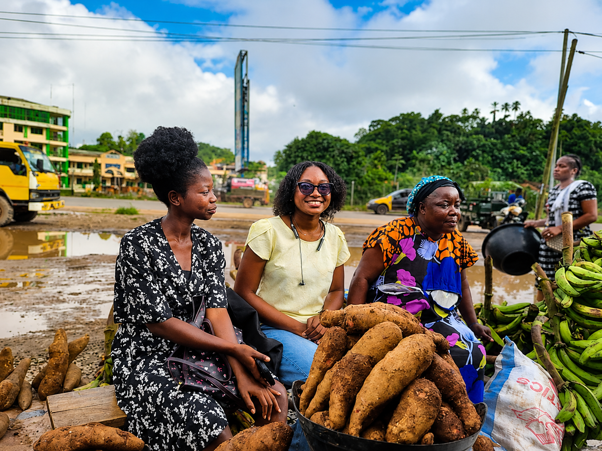
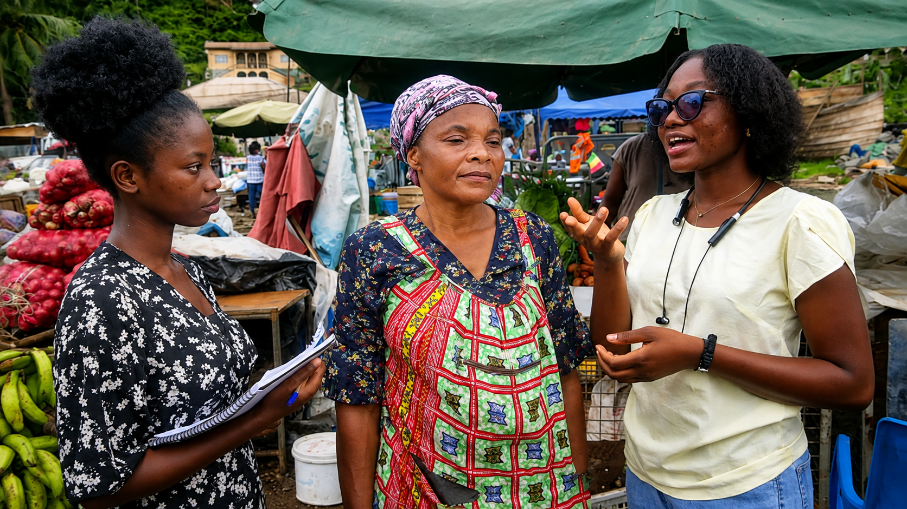
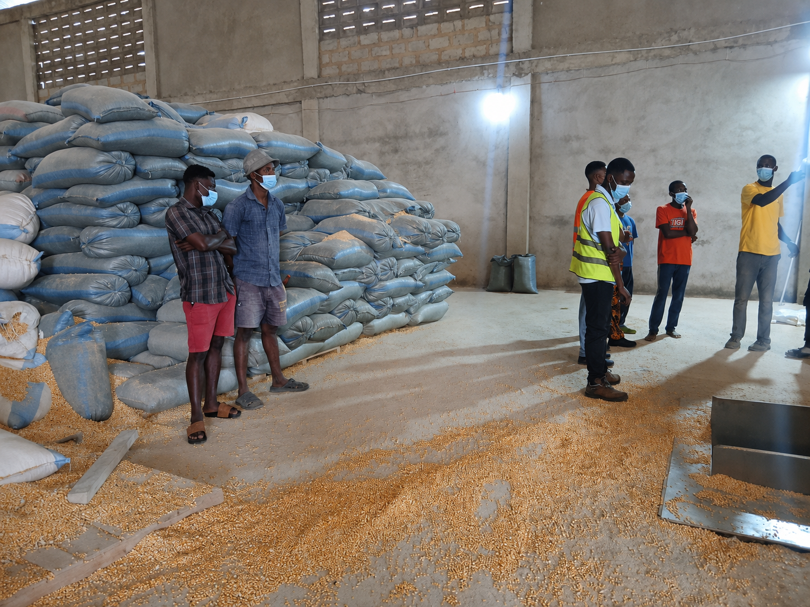

# Kuapa Dwaso

## Demand Before Movement

### The operating model, field evidence and 90-day pilot behind our pitch

**Prepared for:** GDSS-PSInno AgriTech Innovation Challenge judges  
**Proposed pilot corridor:** Tarkwa-Takoradi, Western Region, Ghana  
**Funding request:** GH₵10,000 for a controlled 90-day pilot  
**Official contact:** [info@kuapadwaso.com](mailto:info@kuapadwaso.com)

> Kuapa Dwaso means “Farmer’s Market” in Akan. Our goal is to make that name practical: farmers should be able to reach dependable buyers, and buyers should be able to count on dependable supply.

---

## A note to the judges

Our presentation intentionally keeps each idea concise. This document explains the operating model behind those slides, the field learning that shaped it, the assumptions we still need to test and the evidence the proposed pilot is designed to produce.

Kuapa Dwaso is not presenting a nationwide agricultural transformation as an accomplished result. We are presenting a focused way to test whether a specific produce corridor can become more reliable, accountable and commercially sustainable.

The central idea is simple:

> **A farmer’s produce should move because a credible sale exists, not in the hope that one might.**

That principle changes how buyer discovery, farmer consent, quality control, transport, payment and future storage should work.

---

## Begin With the People Behind the Model

This proposal began in the field, not in a feature list. Our two published stories introduce the people, places and conversations behind the decisions explained in this brief:

| Field story | Why it matters |
| --- | --- |
| [Listening Before Building: What Farmers and Traders in Tarkwa Taught Us](https://kuapadwaso.com/blog/tarkwa-farmer-trader-visit-learnings) | Shows how fragmented transport, uncertain buyers, delayed payment and stronger-than-expected household smartphone access changed our understanding of the problem. |
| [Learning Through Partnership: Our Visit to Extech Agricultural Services](https://kuapadwaso.com/blog/extech-agricultural-services-visit) | Explains why Kuapa Dwaso will begin through experienced partners and verified demand instead of investing immediately in warehouse infrastructure. |

The stories provide the human account. The chapters that follow translate those observations into an operating model, commercial structure and measurable pilot.

---

# Table of Contents

1. [Executive Summary](#1-executive-summary)
2. [The Challenge We Are Responding To](#2-the-challenge-we-are-responding-to)
3. [What We Learned in Tarkwa](#3-what-we-learned-in-tarkwa)
4. [Why Another Listing Marketplace Is Not Enough](#4-why-another-listing-marketplace-is-not-enough)
5. [The Kuapa Dwaso Operating Model](#5-the-kuapa-dwaso-operating-model)
6. [Ownership, Custody and Accountability](#6-ownership-custody-and-accountability)
7. [Storage Follows Demand](#7-storage-follows-demand)
8. [Learning Through Extech Agricultural Services](#8-learning-through-extech-agricultural-services)
9. [Technology Supports the Operation](#9-technology-supports-the-operation)
10. [One Corridor, One Crop Decision](#10-one-corridor-one-crop-decision)
11. [Commercial Model](#11-commercial-model)
12. [What GH₵10,000 Will Prove](#12-what-gh10000-will-prove)
13. [The 90-Day Pilot](#13-the-90-day-pilot)
14. [What a Reliable Corridor Means](#14-what-a-reliable-corridor-means)
15. [Scalability Without Premature Infrastructure](#15-scalability-without-premature-infrastructure)
16. [Key Risks and How the Pilot Addresses Them](#16-key-risks-and-how-the-pilot-addresses-them)
17. [Alignment With the Challenge Assessment](#17-alignment-with-the-challenge-assessment)
18. [What Is Decided and What Is Still Being Tested](#18-what-is-decided-and-what-is-still-being-tested)
19. [The Decision We Are Asking the Judges to Make](#19-the-decision-we-are-asking-the-judges-to-make)
20. [Appendix A: Source and Evidence Notes](#appendix-a-source-and-evidence-notes)
21. [Appendix B: Claim Status Ledger](#appendix-b-claim-status-ledger)
22. [Appendix C: Kuapa Dwaso Team](#appendix-c-kuapa-dwaso-team)

---

# 1. Executive Summary

The GDSS-PSInno challenge asks teams to improve the connection between smallholder farmers and buyers while addressing the logistics and delivery failures that make agricultural trade expensive and unreliable.

Kuapa Dwaso responds with a demand-led agricultural market-linkage, aggregation and fulfilment service.

We do not begin by asking farmers to upload produce and wait. We begin with a buyer requirement. Kuapa Dwaso captures the crop, quantity, quality, price, destination and payment period; identifies farmers who can fulfil the requirement; presents the complete terms to those farmers; verifies the produce before movement; aggregates a commercially viable quantity; coordinates transport; documents delivery and acceptance; and follows the transaction through to farmer settlement.

Kuapa Dwaso does not generally buy the produce itself. The farmer remains the owner until a sale is accepted under the agreed terms, and title passes directly from the farmer to the buyer at the point defined by the transaction agreement. Kuapa Dwaso remains accountable for coordinating the sale without becoming a speculative produce trader.

Our current commercial model is a 10% commission on completed, accepted produce sales. Transport is quoted and negotiated separately. Temporary storage is used only when a live transaction requires it and is also priced separately.

We will not begin by building or operating a warehouse. The initial model is asset-light and partnership-led. Existing facilities may support temporary holding where necessary. Owned warehouse infrastructure is an indicative longer-term ambition, currently projected at approximately three years, but only if transaction evidence proves where it is needed and how it can remain utilised.

The proposed 90-day pilot will test one crop or tightly limited crop set in one defined corridor, with a controlled group of farmers, repeat business buyers and known logistics partners. The pilot will measure whether:

1. confirmed demand can be matched to dependable supply;
2. produce can be delivered at the agreed quantity and quality;
3. farmers can be paid according to terms accepted before movement; and
4. the transaction can leave Kuapa Dwaso with a positive and understandable contribution margin.

The GH₵10,000 first prize would fund that operating evidence rather than fixed infrastructure.

---

# 2. The Challenge We Are Responding To

The competition brief describes a market in which small-to-medium-scale farmers struggle to reach reliable buyers and fair pricing, particularly when dealing with time-sensitive vegetables. It also identifies poor logistics coordination, fragmented delivery, transportation delays and weak distribution networks as causes of spoilage, cost and lost farmer income.

The challenge brief provides two national context figures:

- Ghana is estimated to lose **20-50% of fruits and vegetables after harvest**.
- The associated annual economic loss is estimated at **US$1.9-3 billion**.

These figures establish the scale of the national problem. They are not Kuapa Dwaso pilot results, a forecast of our revenue or a claim that our intervention alone can eliminate all post-harvest loss.

The same brief encourages participants to focus on a particular agricultural supply region rather than attempting to solve the problem for all of Ghana. It evaluates solutions on accessibility, sustainability, usability, transaction flow, logistics coordination, practical relevance, adoption potential and low-bandwidth considerations.

Kuapa Dwaso has therefore chosen depth over premature scale: understand one corridor, complete real transactions and use the resulting evidence to decide what should grow next.

---

# 3. What We Learned in Tarkwa

On 1 and 3 July 2026, Kuapa Dwaso team members Ms Catherine Bruce Vochere and Ms Hannah Nankon Gyekyiwaa conducted two field engagements around the market near the University of Mines and Technology in Tarkwa. The first engagement focused mainly on traders. The Friday engagement allowed the team to learn more about the farmer side of the transaction.

> **Publication check:** The exact local name of the market should be confirmed before the final PDF is issued.

## 3.1 Produce can become expensive before it reaches a buyer

The traders described a fragmented physical journey. Poor farm-road access can prevent a truck from reaching the production area directly. A load may move through several hands and vehicle types:

> Farm or village → manual carrying → tricycle → collection point → truck → city market

Every additional stage can introduce:

- another transport or handling payment;
- more time before the produce reaches a buyer;
- greater risk of bruising, contamination or spoilage;
- less certainty about the final quantity and condition; and
- a higher final price for the trader or consumer.

This pattern will not apply identically to every community or crop. It is a field-derived explanation of why the pilot must record route stages, costs, time, condition and custody rather than treating “delivery” as one simple event.

## 3.2 Farmers may arrive before a sale exists

The farmer engagement exposed a deeper risk. A farmer may harvest produce, pay for movement into the city and only then discover what price or payment arrangement is available.

At that point:

- the transport cost has already been paid;
- returning with the produce may be uneconomical;
- perishability reduces the time available to negotiate;
- a buyer may not have cash available immediately; and
- the farmer may feel forced to leave produce and wait for payment.

The result can be a low price or an informal credit arrangement that the farmer did not freely choose before beginning the journey.

This shifted our understanding. The problem is not merely that farmers and buyers cannot discover one another. The problem is that too many commercial decisions remain unresolved until after the farmer has taken on most of the risk.

## 3.3 Traders also experience unreliability

The field learning should not be reduced to a conflict between farmers and traders. Traders and other buyers also need dependable supply.

They need to know:

- whether the produce is genuinely available;
- whether enough quantity can be assembled;
- whether it meets the expected quality;
- whether it will arrive on time; and
- whether the relationship can support repeat orders.

Some traders source through other traders and intermediaries instead of dealing directly with farmers. This can make production capacity and farmer-level supply difficult to see.

## 3.4 Smartphone access was better than we assumed

We initially expected USSD or two-way SMS commands to be the main way farmers would access Kuapa Dwaso. The farmers engaged around Tarkwa indicated that many either had a smartphone or lived with someone who could assist them with one.

That finding changed our starting point:

- the main experience will run through a lightweight browser interface;
- farmers may register directly or receive assisted access from a trusted household member or Kuapa Dwaso representative; and
- SMS will provide concise updates about offers, produce status, delivery and payment.

This does not prove that every farmer in Ghana has suitable smartphone access. We will retest the assumption in each new operating community. USSD remains a future option if field evidence demonstrates that it is necessary, but it is not required for the initial pilot.

---

# 4. Why Another Listing Marketplace Is Not Enough

Different market participants already solve valuable parts of the problem:

| Participant | Existing value | Gap that remains |
| --- | --- | --- |
| Produce traders | Find outlets, move produce and provide market knowledge | Demand, price and payment terms can remain informal until after movement. |
| Listing marketplaces | Make buyers and sellers discoverable | A listing does not itself inspect quality, aggregate supply, coordinate custody, deliver the order or settle payment. |
| Logistics providers | Move goods between locations | A vehicle does not confirm that a credible sale, acceptable quality or payment arrangement exists. |
| Warehouse operators | Store and manage physical inventory | Storage capacity does not create buyer demand or guarantee commercially useful utilisation. |

Kuapa Dwaso’s role is to connect those pieces around one accountable transaction.

When our slides say Kuapa Dwaso “owns the sale,” we do **not** mean that Kuapa Dwaso owns the farmer’s produce. We mean that Kuapa Dwaso does not disappear after making an introduction. We remain responsible for coordinating the process from the buyer requirement to the record of farmer settlement.

Our initial focus is deliberately narrow:

1. confirm demand and commercial terms;
2. verify and aggregate suitable farmer supply;
3. check quality before the costly movement stage;
4. coordinate delivery, acceptance and settlement; and
5. retain enough evidence to resolve exceptions fairly.

We are not initially attempting to solve input credit, general farm productivity, consumer grocery delivery, nationwide warehousing or every agricultural value-chain problem.

---

# 5. The Kuapa Dwaso Operating Model

## 5.1 Demand comes first

A buyer begins by communicating:

- crop and variety, where relevant;
- required quantity and unit;
- grade or quality specification;
- price or agreed price-determination method;
- receiving location;
- required delivery date or recurring schedule;
- payment method and payment period; and
- acceptance and rejection conditions.

Kuapa Dwaso assesses whether the buyer is credible and whether the order is commercially useful before asking farmers to commit produce.

## 5.2 Suitable farmer supply is identified

Kuapa Dwaso uses its farmer and partner network to determine:

- which farmers grow the required crop;
- when their produce is available;
- realistic quantities;
- production and collection locations;
- road and first-mile transport conditions;
- likely quality; and
- previous fulfilment reliability, where available.

Over time this becomes a verified supply network rather than a collection of hopeful listings.

## 5.3 The farmer sees the terms before accepting

Before committing produce, the farmer sees:

- the buyer’s price;
- the requested quantity;
- the quality standard;
- Kuapa Dwaso’s commission;
- any separate transport or storage charge assigned to the farmer;
- the expected collection and delivery dates;
- the buyer’s payment period; and
- the expected net settlement.

The farmer can accept or reject the offer. Produce does not move until the farmer has accepted the terms.

## 5.4 Produce is checked before movement

Kuapa Dwaso or an approved partner inspects the produce against the buyer-approved specification. The exact checklist is crop-specific and may include:

- variety;
- maturity or ripeness;
- moisture where relevant;
- freshness and visual condition;
- pest or disease damage;
- contamination;
- size or grade;
- packaging condition;
- weight or bag count;
- accepted and rejected quantity;
- photographs or samples; and
- inspection time, place and responsible person.

The purpose is to identify a mismatch before the expensive transport leg. The buyer cannot fairly introduce a new quality requirement after the produce has already moved.

## 5.5 Orders are combined into viable delivery runs

Kuapa Dwaso does not intend to fulfil very small orders that cannot support collection and transportation costs.

The pilot will help determine:

- the minimum individual order;
- the minimum combined load for a route;
- order cutoff times;
- scheduled delivery days; and
- when a run should be confirmed, postponed or cancelled.

Several trader orders may be combined into one commercially sensible delivery. This allows the pilot to remain controlled without testing an uneconomic transaction size.

## 5.6 Logistics are coordinated as part of the transaction

Kuapa Dwaso maps the real movement stages and agrees on:

- collection points;
- manual loading where needed;
- first-mile tricycle or small-vehicle movement;
- consolidated truck movement;
- loading and unloading responsibilities;
- departure and receiving windows;
- transport price and payer;
- custody handoffs; and
- procedures for delay, damage or loss.

Quantity, condition and custody are recorded at the handoffs that materially affect responsibility.

## 5.7 Delivery is accepted against the original specification

At delivery, the buyer records:

- quantity delivered;
- quantity accepted;
- quantity rejected and the specific reason;
- condition on arrival;
- delivery time;
- relevant visual evidence; and
- acknowledgement by the receiving representative.

Commission is earned only on the accepted, completed sale, not on a cancelled or fully rejected order.

## 5.8 The farmer is paid under terms accepted in advance

Payment behaviour differs between crops and buyers. Some maize transactions may be paid immediately; another crop or buyer may use an agreed period such as one week.

Kuapa Dwaso communicates that period before the farmer accepts the sale. The farmer is paid when the buyer releases the funds. We will not initially promise to advance the buyer’s payment from Kuapa Dwaso’s own working capital.

Deferred payment is therefore not hidden. It is a commercial term that the farmer can accept or reject before movement.

---

# 6. Ownership, Custody and Accountability

Ownership and custody are not the same.

- The farmer owns the produce before the sale.
- Kuapa Dwaso may coordinate or temporarily hold custody without buying it.
- A transporter may hold custody while the farmer still owns the produce.
- Title passes directly from the farmer to the buyer at the point defined in the accepted transaction terms.
- Kuapa Dwaso does not become the produce owner between the two parties.

Our accountability model follows the consignment across three periods.

## Before movement

- **Buyer specification:** Defines the standard against which the order will be accepted.
- **Farmer acceptance:** Shows that the farmer saw the price, fees, logistics and payment period.
- **Pre-dispatch inspection:** Records the starting quantity and condition.

## In transit

- **Custody handoff:** Records who held the produce and when responsibility changed.
- **Condition evidence:** Helps identify where damage, loss or weight variance occurred.
- **Route events:** Record delays, rerouting and other exceptions.

## At delivery and settlement

- **Buyer decision:** Acceptance or rejection refers to the original specification.
- **Payment obligation:** The buyer’s agreed amount and due date remain visible.
- **Farmer settlement:** Gross value, commission, accepted deductions and net payout remain traceable.

### Working exception framework

| Exception | Evidence required | Initial response |
| --- | --- | --- |
| Produce fails inspection before dispatch | Buyer specification and inspection record | Do not dispatch it for that order; revise the quantity or supply match. |
| Damage occurs during transport | Before-and-after condition evidence and custody timestamps | Identify the affected transport leg and apply the carrier agreement. |
| Buyer rejects produce | Original specification, delivery evidence, samples or photographs, and written reason | Reconcile the decision against the pre-agreed criteria. |
| Delivered weight differs from collected weight | Weights at collection, loading and delivery | Investigate handling, moisture change, measurement or loss at the relevant stage. |
| Buyer payment is late | Acceptance record, invoice and agreed due date | Escalate collection, restrict further orders and record buyer performance. |
| Partner-held produce deteriorates | Intake condition, storage record and release condition | Apply the documented storage partner’s custody and liability terms. |

Legal terms, insurance limits and dispute procedures will be finalised for the selected crop, partners and transaction structure before the pilot begins.

---

# 7. Storage Follows Demand

Our early product thinking made a warehouse the centre of the model. Field and industry learning showed us that a warehouse should be a capability used when demand justifies it, not the starting assumption.

## Phase 1: Direct movement

The preferred early transaction moves from farmer collection points to the confirmed buyer without Kuapa Dwaso owning or operating a facility.

This keeps fixed costs low and exposes the real economics of:

- farmer sourcing;
- inspection;
- first-mile collection;
- aggregation;
- main transport;
- delivery; and
- settlement.

## Phase 2: Partner holding where necessary

An existing facility may be used temporarily when:

- several farmer lots must be combined;
- collection and buyer-receiving times do not align;
- the crop can be held safely for the required period;
- the storage cost is supported by the transaction economics; and
- ownership, condition, fees, access, shrinkage and liability are documented.

Partner storage is a transaction tool. It is not a default destination for produce that has no buyer.

## Phase 3: Own or lease only when justified

Kuapa Dwaso currently sees owned warehouse infrastructure as a possible ambition in approximately three years. That is not a fixed construction deadline.

A facility would proceed only after evidence demonstrates:

- repeated transaction volume;
- predictable storage demand;
- commercially useful utilisation across relevant seasons;
- the right crop and location;
- the ability to cover staffing, security, electricity, maintenance, insurance and debt;
- adequate quality, spoilage and shrinkage controls; and
- a stronger financial case for ownership than continued partnership.

This phased model preserves the original warehouse purpose: giving farmers a buffer and stronger negotiating position where storage is genuinely useful. It avoids burdening the business with expensive infrastructure before the market has been proven.

---

# 8. Learning Through Extech Agricultural Services

On Friday, 7 August 2026, Ms Catherine Bruce Vochere and Mr Kevin Amisom Nchorbuno visited Extech Agricultural Services in Takoradi. Extech also facilitated a visit to an agricultural warehouse.

The visit reinforced three important lessons.

## 8.1 Agriculture is relationship-driven

New entrants cannot reproduce years of farmer relationships, buyer connections, local knowledge and operating experience immediately. Beginning through experienced partners gives Kuapa Dwaso a more credible path to its first transactions.

## 8.2 A warehouse does not create demand

Physical infrastructure can support trade, but it cannot guarantee repeat buyers, suitable crops, payment discipline or profitable utilisation. The transaction network must be proven first.

## 8.3 Partnership can reduce the risk of the pilot

Extech expressed willingness to support Kuapa Dwaso’s early development by:

- helping connect us with farmers around intended operating areas;
- helping fulfil controlled pilot orders; and
- creating a possible path to larger-volume opportunities for produce such as maize.

The exact role must be documented for each transaction. Extech may act as a farmer-network partner, sourcing partner, buyer, buyer-linkage partner or a combination of these roles.

For judge-facing accuracy, this should be understood as a working partnership understanding. Kuapa Dwaso will not present specific quantities, prices, responsibilities or exclusivity as final until they are formally agreed.

---

# 9. Technology Supports the Operation

Kuapa Dwaso’s innovation is not technology for its own sake. The platform exists to make commercial promises and physical handoffs visible and accountable.

## For farmers

The lightweight browser experience supports:

- registration and a simple farmer profile;
- available and expected produce information;
- buyer offers and commercial terms;
- farmer acceptance or rejection;
- produce and delivery status;
- commission and deduction visibility;
- expected payout and payment status; and
- issue reporting.

Farmers who need help can receive assisted access. A family member may help use the interface, but the farmer must understand and accept the commercial terms governing the produce.

## For buyers

The buyer experience supports:

- buyer verification;
- crop, quantity and quality requirements;
- delivery destination and date;
- price and payment period;
- supply and quality progress;
- delivery acceptance; and
- transaction history.

## For field and logistics operations

Operational records support:

- farmer and produce verification;
- crop-specific quality evidence;
- quantities and weights;
- aggregation status;
- transport assignments;
- custody handoffs;
- delivery events;
- exceptions and disputes; and
- audit history.

## For administrators

The administrative view should separate:

- gross produce value;
- value due to farmers;
- Kuapa Dwaso commission revenue;
- transport and storage pass-through amounts;
- buyer receivables;
- farmer settlements;
- losses, claims and adjustments;
- direct operating costs; and
- contribution margin.

## Low-bandwidth approach

The prototype is designed around:

- a browser experience without an app-store dependency;
- simple farmer-facing pages;
- limited and compressed imagery where practical;
- recoverable form drafts where practical;
- clear failure and retry states; and
- one-way SMS for important updates.

The current deck shows controlled network profiles of 8 Mbps with 120 ms latency and 1 Mbps with 180 ms latency. These are laboratory test conditions, not measured farmer-network speeds or proof of field performance. Real-user performance will be measured during the pilot.

We also do not claim that every transaction can be completed fully offline. Recoverable drafts and resilient error states are different from offline authentication, live inventory or payment settlement.

---

# 10. One Corridor, One Crop Decision

The proposed initial operating corridor is Tarkwa-Takoradi in the Western Region.

This corridor is a working pilot scope because:

- Tarkwa is where the team conducted farmer and trader research;
- Takoradi is where the team engaged Extech and explored industry partnership;
- the geography is narrow enough to measure real logistics; and
- it creates a defined environment for observing buyer behaviour, farmer supply and partner roles.

The corridor has not yet been proven profitable.

## Primary buyer direction

The pilot will focus on business buyers capable of commercially useful and repeat orders. This may include:

- a controlled group of traders whose payment and ordering behaviour can be assessed;
- wholesalers;
- processors; and
- other credible bulk purchasers.

Kuapa Dwaso will not fulfil uneconomically small orders merely to increase order count. Several smaller trader requirements may be combined into one viable run.

## Crop candidates

Crops discussed so far include maize, pepper, cabbage, rice and other produce that may match verified demand and supply.

Maize is an important candidate because the Extech engagement suggested a path to farmer supply and larger-volume buying opportunities. It is not yet the final pilot crop.

The competition particularly focuses on the vegetable supply chain. Pepper, cabbage and other vegetables may therefore offer stronger direct challenge alignment if they also pass the commercial and operational tests. Maize can remain a valuable partner opportunity and comparator without being presented prematurely as the final competition pilot crop.

## The crop must pass three gates

### Buyer gate

- Is there an identifiable and credible buyer?
- Is the demand repeatable?
- Are quantity, quality, price, destination and payment terms clear?

### Supply gate

- Are enough suitable farmers reachable?
- Are harvest timing and realistic quantities known?
- Can the supply be combined without excessive collection cost?

### Transaction-economics gate

- Can quality be verified before movement?
- What will first-mile collection, loading, main transport and handling cost?
- When will the buyer pay and the farmer be settled?
- Does Kuapa Dwaso retain a positive contribution margin?

No crop should be selected solely because it is common, easy to store or discussed by one potential partner.

---

# 11. Commercial Model

Kuapa Dwaso’s current operating assumption is a **10% commission on the gross value of produce accepted by the buyer**.

The commission:

- applies only to an accepted and completed sale;
- is disclosed before the farmer accepts the transaction;
- is separated from transport, storage and other pass-through charges;
- is recorded as Kuapa Dwaso revenue rather than farmer-owned value; and
- will be adjusted if pilot evidence shows that another percentage is fairer and more sustainable.

The current farmer settlement model is:

> Gross accepted produce value  
> minus Kuapa Dwaso commission  
> minus only those separate charges assigned to and accepted by the farmer  
> equals net farmer settlement

Transport and temporary storage are negotiated separately. The farmer, buyer or both may carry those costs depending on the transaction, but the payer must be identified before acceptance.

### Illustrative transaction only

| Item | Amount |
| --- | ---: |
| Gross value of produce accepted | GH₵8,000 |
| Kuapa Dwaso commission at 10% | GH₵800 |
| Separately quoted logistics | GH₵600 |

This example explains the calculation. It is not a completed sale, supplier quotation or forecast of pilot revenue.

## Financial terms that must remain separate

- **Gross produce value:** Total value of accepted produce.
- **Farmer-owned value:** Amount due to farmers after visible, accepted deductions.
- **Kuapa Dwaso revenue:** Commission on accepted sales.
- **Pass-through logistics or storage:** Amount paid to service partners, not automatically Kuapa Dwaso revenue.
- **Variable operating cost:** Inspection, coordination, communication, handling and other costs borne by Kuapa Dwaso.
- **Contribution margin:** Kuapa Dwaso revenue minus Kuapa Dwaso-borne variable costs.
- **Buyer receivable:** Accepted amount not yet paid by the buyer.
- **Risk reserve:** Controlled pilot protection money, not revenue or profit.

---

# 12. What GH₵10,000 Will Prove

The proposed allocation directs the full prize toward pilot execution rather than warehouse construction.

| Category | Amount | Share | Intended result |
| --- | ---: | ---: | --- |
| Pilot logistics subsidies | GH₵4,000 | 40% | Complete controlled aggregated runs while measuring the real corridor cost. |
| Quality inspection tools | GH₵3,500 | 35% | Establish repeatable pre-dispatch quantity and crop-quality checks. |
| Field onboarding | GH₵1,500 | 15% | Verify participants, explain terms and prepare the operating network. |
| Transaction risk reserve | GH₵1,000 | 10% | Resolve approved pilot exceptions without hiding the responsible event. |
| **Total** | **GH₵10,000** | **100%** | **Convert the idea into measurable operating evidence.** |

## 12.1 Pilot logistics subsidies - GH₵4,000

| Working use | Cap | Purpose |
| --- | ---: | --- |
| First-mile tricycle collection | GH₵1,400 | Move farmer lots to an accessible aggregation point. |
| Consolidated truck contribution | GH₵2,000 | Support the main corridor delivery leg for controlled pilot orders. |
| Loading, unloading and handoff handling | GH₵400 | Cover documented physical handling required by the pilot. |
| Route communication and verified variation | GH₵200 | Support transaction communication and small documented route changes. |
| **Total** | **GH₵4,000** | |

The subsidy will be recorded per transaction. Reporting will distinguish the subsidised pilot payment from the underlying unsubsidised route cost.

## 12.2 Quality inspection tools - GH₵3,500

| Working use | Cap | Purpose |
| --- | ---: | --- |
| Portable moisture testing | GH₵1,200 | Relevant if maize or another moisture-sensitive crop is selected. |
| Reliable field weighing scale | GH₵1,300 | Verify quantity before dispatch and reconcile custody handoffs. |
| Grading and sampling kit | GH₵600 | Provide crop-appropriate labels, sample materials and grading aids. |
| Calibration, batteries and protective records | GH₵400 | Keep tools usable and records consistent. |
| **Total** | **GH₵3,500** | |

The tool mix will change if a perishable vegetable is selected. Crates, temperature or condition measurement and visual grading may be more useful than moisture testing.

## 12.3 Field onboarding - GH₵1,500

| Working use | Cap | Purpose |
| --- | ---: | --- |
| Local field travel and site visits | GH₵600 | Reach farmers, buyers, collection points and operating partners. |
| Assisted registration and verification | GH₵400 | Capture participant identity, location, supply and consented contact details. |
| Orientation, records and SMS materials | GH₵300 | Explain quality, price, fees, payment terms and transaction updates. |
| Field representative briefing and checklists | GH₵200 | Ensure the pilot process is followed consistently. |
| **Total** | **GH₵1,500** | |

## 12.4 Transaction risk reserve - GH₵1,000

| Working use | Cap | Purpose |
| --- | ---: | --- |
| Independent reinspection or reconciliation | GH₵300 | Resolve a justified quality or acceptance dispute. |
| Emergency rerouting or redelivery contribution | GH₵400 | Protect a valid order during a documented logistics exception. |
| Settlement or claim-resolution buffer | GH₵300 | Address a small approved exception while responsibility is determined. |
| **Total** | **GH₵1,000** | |

The reserve will not become a routine discount, hidden operating expense or blanket protection against negligence.

## Budget controls

- Assign one budget owner and a separate approver.
- Connect every cost to a pilot activity or transaction code.
- Retain receipts, mobile-money records, quotations and acknowledgements.
- Record budget, actual cost, reason, payer and beneficiary.
- Approve reserve spending case by case.
- Report subsidised and unsubsidised logistics separately.
- Document reallocations before spending.

## What the prize will not fund

- construction, purchase or lease of a Kuapa Dwaso warehouse;
- speculative produce purchases without confirmed demand;
- broad consumer advertising;
- unrelated general salaries;
- nationwide deployment; or
- ordinary losses without investigation and accountability.

The sub-allocations above are working caps, not supplier quotations. They will be updated after the crop, routes, transaction count and inspection method are confirmed.

---

# 13. The 90-Day Pilot

The proposed pilot is deliberately controlled. “Small” describes the number of participants and the business exposure, not an uneconomically small load.

| Period | Operational focus | Intended output |
| --- | --- | --- |
| Days 1-15 | Confirm buyer requirements, crop choice, partner roles, fee rules and payment terms | Written pilot scope and transaction terms |
| Days 16-35 | Verify farmers, supply, collection points, harvest timing, route costs and inspection method | Supply register and executable order plan |
| Days 36-75 | Complete controlled transactions and record quality, custody, delivery, payment and costs | Transaction records and exception log |
| Days 76-90 | Reconcile results, interview participants and calculate unit economics | Pilot report and repeat, revise or stop decision |

## The pilot must answer three questions

### 1. Did the corridor work?

Measure:

- quantity ordered, sourced, delivered and accepted;
- fill and acceptance rates;
- collection and delivery time;
- first-mile and main transport costs;
- handling, spoilage and rejection losses;
- condition and weight differences; and
- exceptions by custody stage.

### 2. Did people get paid as agreed?

Measure:

- buyer payment date compared with the agreed date;
- farmer settlement date;
- gross value, commission, deductions and adjustments;
- overdue amounts;
- payment disputes and resolution time; and
- whether participants understood the terms before movement.

### 3. Can this become a sustainable business?

Measure:

- repeat buyer demand;
- repeat farmer participation;
- commission revenue;
- Kuapa Dwaso-borne variable costs;
- contribution margin per transaction;
- logistics cost without subsidy; and
- the conditions under which storage would create or destroy value.

## Proposed metric definitions

| Metric | Calculation |
| --- | --- |
| Order fill rate | Accepted quantity ÷ ordered quantity |
| Delivery acceptance rate | Accepted quantity ÷ delivered quantity |
| Handling or loss rate | Quantity lost or unusable ÷ quantity collected |
| On-time delivery rate | Deliveries completed by the agreed time ÷ completed deliveries |
| Buyer payment delay | Actual payment date minus agreed payment date |
| Farmer settlement time | Farmer payout time minus buyer acceptance time |
| Repeat demand rate | Buyers placing another qualified order ÷ pilot buyers |
| Contribution margin | Kuapa Dwaso commission revenue minus Kuapa Dwaso-borne variable cost |

Exact target values will be set after the crop, quantity, buyer group and partner roles are confirmed. We prefer transparent baselines to invented precision.

---

# 14. What a Reliable Corridor Means

Reliable does not mean perfect, risk-free or nationwide.

It means that for a defined crop, route, buyer group and operating process, Kuapa Dwaso can repeatedly explain:

- who ordered;
- who supplied;
- what quality was agreed;
- whether the farmer accepted the price and payment period;
- who handled the produce at every important stage;
- what quantity was accepted or rejected;
- what every participant was charged;
- when the buyer paid;
- when the farmer was settled; and
- whether the transaction produced a sustainable margin.

The pilot may reveal that the crop, route, fee or process needs to change. That is still useful evidence if it is measured honestly.

---

# 15. Scalability Without Premature Infrastructure

Kuapa Dwaso is designed to scale by repeating an operating pattern, not by claiming nationwide coverage immediately.

## Step 1: Prove one crop and corridor

Establish buyer demand, farmer supply, quality rules, route costs, payment behaviour and contribution margin.

## Step 2: Deepen the local network

Increase repeat buyers, verified farmers, order frequency and delivery-run utilisation within the proven corridor.

## Step 3: Add compatible crops or destinations

Expand only where the new crop or route can reuse trusted relationships, collection points, transport capacity or buyer demand.

## Step 4: Formalise partner infrastructure

Use partner holding, inspection or processing facilities where repeated transactions demonstrate a real need.

## Step 5: Consider owned infrastructure

Build or lease only where utilisation and transaction economics make ownership more valuable than partnership.

Technology supports this progression by preserving buyer requirements, farmer capacity, quality history, delivery performance and payment behaviour. The resulting transaction record becomes more valuable as the network repeats—not because data alone is the product, but because it helps Kuapa Dwaso make more reliable commitments.

---

# 16. Key Risks and How the Pilot Addresses Them

| Risk | Why it matters | Pilot response |
| --- | --- | --- |
| Buyer demand is not firm | Produce may be collected without a genuine sale. | Require written requirements and meaningful commitment before aggregation. |
| Farmer supply is overstated | Kuapa Dwaso may promise quantity it cannot deliver. | Verify farmers, harvest timing, available volume and collection constraints. |
| Quality differs from expectation | The buyer may reject produce after transport costs are incurred. | Use crop-specific pre-dispatch inspection against the buyer’s written standard. |
| Transport is too expensive | A completed delivery may still lose money. | Record each movement stage and calculate unsubsidised cost per accepted unit. |
| Produce is damaged in transit | Farmer value and buyer trust are lost. | Record condition and custody at material handoffs and agree carrier responsibility. |
| Buyer pays late | Farmers and Kuapa Dwaso face cash-flow pressure. | Disclose payment terms, assess buyers and restrict repeat orders after poor performance. |
| The 10% commission is unsuitable | The model may be unfair or financially weak. | Measure actual variable costs and participant willingness before fixing the long-term rate. |
| Partnership roles are unclear | Gaps or duplicated responsibility may appear during fulfilment. | Define each partner’s role, fee, custody, escalation contact and evidence requirement. |
| Smartphone access is weaker elsewhere | Some farmers may be excluded. | Use assisted access, SMS updates and repeat access research in every new community. |
| Warehouse investment happens too early | Fixed costs arrive before utilisation and demand. | Use direct movement and partner facilities until repeated evidence supports ownership. |

---

# 17. Alignment With the Challenge Assessment

| Assessment factor | Kuapa Dwaso response |
| --- | --- |
| Accessibility and usability | Lightweight browser access, assisted onboarding, simple farmer views and SMS updates. |
| Scalability and sustainability | Corridor-by-corridor growth, repeat business demand and infrastructure only after utilisation evidence. |
| User-friendly workflow | Buyer requirement, farmer acceptance, inspection, delivery and settlement form one traceable process. |
| Product discovery and transaction flow | Demand is captured first and matched to verified supply instead of relying only on listings. |
| Logistics coordination | First-mile, aggregation, main transport, custody and delivery are included in the operating model. |
| Innovation and practical relevance | Kuapa Dwaso coordinates the sale end to end while farmers retain ownership. |
| Real-world adoption and impact | The model is grounded in Tarkwa field engagements and an agricultural industry visit in Takoradi. |
| Target supply-chain relevance | Crop selection is gated by verified demand, supply and economics, with vegetable candidates kept central to challenge relevance. |
| Low-bandwidth consideration | Browser-first, low-image farmer pages, recoverable drafts, clear retries and SMS notifications. |
| Smart matching potential | Farmer capacity, buyer requirements, quality and performance history can support better matching after enough real data exists. |

---

# 18. What Is Decided and What Is Still Being Tested

## Decisions already made

1. Kuapa Dwaso coordinates direct farmer-to-buyer sales and does not generally buy the produce itself.
2. Farmers retain ownership until a sale transfers title directly to the buyer under the accepted terms.
3. Buyer demand and commercial terms are confirmed before produce moves.
4. Farmers see and accept price, quality, commission, applicable charges and payment period in advance.
5. Kuapa Dwaso performs or coordinates pre-dispatch quality control.
6. The current commission is 10% of completed, accepted produce sales.
7. Transport and storage are negotiated separately.
8. Kuapa Dwaso will not operate its own warehouse during the initial phase.
9. The entry strategy is partnership-led.
10. The pilot will use commercially viable aggregated loads rather than uneconomic individual deliveries.
11. The initial access model is lightweight web plus assisted access and SMS updates, not USSD-first.
12. Owned warehouse infrastructure is conditional and belongs to a later phase.

## Items to confirm before the pilot starts

- the final crop or tightly limited crop set;
- the exact farmer communities and collection points;
- named buyers and required quantities;
- minimum viable order and delivery-run thresholds;
- crop-specific inspection and rejection standards;
- payment commitment and maximum payment period;
- exact transport routes, costs and custody responsibilities;
- Extech’s role in the first transaction;
- the number of pilot transactions and participants;
- the precise event that triggers commission;
- legal transaction and dispute terms; and
- quantified pilot success thresholds.

These are not weaknesses to conceal. They are the decisions the pilot must ground in evidence.

---

# 19. The Decision We Are Asking the Judges to Make

We are asking the judges to fund the first reliable corridor—not a warehouse, a nationwide rollout or an unsupported projection.

GH₵10,000 will allow Kuapa Dwaso to move from field learning and a working prototype to controlled transactions with recorded demand, supply, quality, logistics, acceptance, payment and unit economics.

At the end of 90 days, we intend to provide a clear answer to three questions:

1. **Did the corridor work operationally?**
2. **Were farmers and service providers paid according to agreed terms?**
3. **Can the transaction be repeated as a sustainable business?**

If the answer is yes, Kuapa Dwaso will have an evidence-based foundation for repeat orders, a deeper farmer network, stronger partnerships and future funding.

If the answer is no, the records will show whether the crop, route, quality process, buyer terms or fee model must change. That is still a responsible use of pilot funding because it prevents a much larger investment based on assumptions.

> **One corridor. Real transactions. Measured in 90 days.**

---

# Appendix A: Source and Evidence Notes

## Competition source

**GDSS-PSInno AgriTech Innovation Challenge brief**  
Provided by the competition organisers. Used for the challenge framing, assessment criteria, prize amount and national post-harvest-loss context.

The national figures in this document are attributed to the competition brief. Before a wider public release outside the competition, the underlying original studies should also be identified and cited.

## Kuapa Dwaso field sources

- *Listening Before Building: What Farmers and Traders in Tarkwa Taught Us* - team field account covering the 1 and 3 July 2026 engagements.
- *Market and Farmer Visit Learnings* - structured summary of transport, payment, farmer-access and market-linkage findings.
- *Learning Through Partnership: Our Visit to Extech Agricultural Services* - team account of the 7 August 2026 Takoradi visit.
- *Kuapa Dwaso Operating Model* - current business source of truth adopted after field, judge and industry feedback.

### Published field stories

The following public stories provide photographs and a more narrative account of the field learning summarised in this brief:

- [Listening Before Building: What Farmers and Traders in Tarkwa Taught Us](https://kuapadwaso.com/blog/tarkwa-farmer-trader-visit-learnings)
- [Learning Through Partnership: Our Visit to Extech Agricultural Services](https://kuapadwaso.com/blog/extech-agricultural-services-visit)

The live URLs were resolved from the published story slugs in `convex/seedFirstBlog.ts` and `convex/seedSecondBlog.ts` and the canonical `/blog/[slug]` route used by the public website.

## Competition and product sources

- *Kuapa Dwaso Deck Explanation and Evidence Brief* - detailed explanation of the final 11-slide presentation.
- *Kuapa Dwaso - Feedback* - first-round judge feedback used to narrow the crop, geography, buyer, aggregation and accountability model.
- Kuapa Dwaso application and architecture documentation - used only for descriptions of current product intent and low-bandwidth design boundaries.

## Photographs

The photographs proposed in this draft come from Kuapa Dwaso’s Tarkwa field engagements and Extech-related warehouse visit. Before final PDF production, the team must confirm:

- that everyone identifiable in a published image has consented;
- the photographer or source credit;
- accurate date and location captions; and
- whether any partner requests approval before publication.

---

# Appendix B: Claim Status Ledger

| Claim or item | Status | Correct interpretation |
| --- | --- | --- |
| 20-50% fruit and vegetable post-harvest loss | Competition-source context | National estimate from the challenge brief, not a Kuapa Dwaso result. |
| US$1.9-3 billion annual economic loss | Competition-source context | National estimate from the challenge brief, not Kuapa Dwaso revenue or market size. |
| Tarkwa field learning | Team field evidence | Based on two local engagements; it should not be generalised automatically to every Ghanaian farmer. |
| Tarkwa-Takoradi corridor | Working pilot scope | Proposed because of field and partnership learning; not yet commercially proven. |
| Business buyers | Working target segment | Initial focus on credible repeat traders, wholesalers, processors and similar purchasers. |
| Maize | Candidate and partner opportunity | Not yet the final competition pilot crop. |
| Pepper, cabbage and other vegetables | Candidate crops | Must pass buyer, supply and transaction-economics gates. |
| Extech support | Working partnership understanding | Exact responsibilities and formal terms must be documented before a transaction. |
| 10% commission | Current operating rule | Applied to completed accepted sales and subject to validation during operations. |
| Separate logistics pricing | Intended commercial rule | Disclosed before farmer acceptance and tracked separately from commission revenue. |
| GH₵10,000 allocation | Working pilot budget | Headline categories sum to the request; sub-lines require quotations and approval. |
| 8 Mbps/120 ms and 1 Mbps/180 ms | Laboratory test conditions | Not measured field speeds or final performance results. |
| Lightweight web plus SMS | Product starting point | Main browser experience with concise notifications and assisted access. |
| Partner storage | Conditional capability | Used only when a live transaction needs it and terms are documented. |
| Owned warehouse in approximately three years | Indicative ambition | Conditional on demand, utilisation, location, capital and unit economics. |
| 90-day pilot | Working duration | Final targets and start date must be confirmed with buyer and partner availability. |

---

# Appendix C: Kuapa Dwaso Team

| Team member | Role |
| --- | --- |
| Nchorbuno Kevin Amisom | Product Engineer |
| Catherine Bruce Vuochere | Growth Lead |
| Nankon Hannah Gyekyiwaa | Product Lead |
| Osei Andrews | Product Designer |
| Obeng Godfred Tweneboah | Product Lead |

**Official contact:** [info@kuapadwaso.com](mailto:info@kuapadwaso.com)  
**Website:** [kuapadwaso.com](https://kuapadwaso.com)
