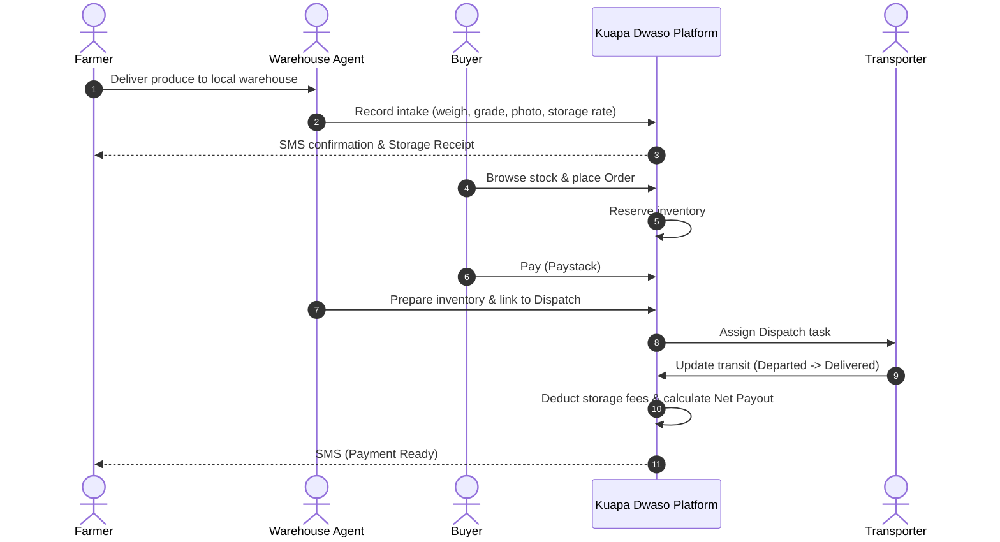

# Kuapa Dwaso: Product Description

Kuapa Dwaso ("Farmer's Market" in Akan) is a warehouse-based platform for produce aggregation, inventory, sales, and dispatch. Built around the realities of agricultural trade in regions like Tarkwa, it replaces risky, speculative farm-to-city transport with a secure, demand-driven local warehouse model.

Official website: [kuapadwaso.com](https://kuapadwaso.com) | GitHub Repository: [Kevin-nav/Kuapa-Dwaso](https://github.com/Kevin-nav/Kuapa-Dwaso.git)

---

## The Problem

Consultations with smallholder farmers and market traders around Tarkwa revealed that the biggest bottleneck in agricultural trade is a fragmented and risky produce movement system. Farmers face high transport costs, poor roads, multiple layers of intermediaries, pressure to sell on credit, and heavy spoilage losses.

Because farming land around Tarkwa is damaged by illegal mining, produce comes from outlying communities and passes through second-chain buyers, loading boys, tricycles, and trucks before reaching the city. Every transfer adds cost and spoilage risk. Worse, a farmer who arrives in the city with perishable goods and no confirmed buyer has almost no bargaining power, and often ends up selling at a discount or on forced credit.

## The Solution

Kuapa Dwaso establishes local community warehouses as physical trust points. Farmers deposit produce nearby instead of transporting it to the city on speculation. The platform then matches warehouse stock to confirmed city demand and coordinates bulk transport only when orders exist.

Key design decisions from field insights:

- **Consignment model:** Farmers retain ownership of stored produce and pay a transparent daily storage fee deducted from sale proceeds, with digital tracking of expected payouts. This avoids the capital burden of the platform buying stock upfront.
- **Demand-driven dispatch:** Traders submit requirements ahead of market windows (especially Friday mornings), so produce leaves the warehouse only against confirmed orders.
- **Landed-cost transparency:** The platform tracks every cost component (produce, loading, tricycle, truck, handling, spoilage buffers) so users understand real margins.
- **Custody tracking:** The system maps the actual supply chain, including second-chain buyers, aggregators, and local transporters.
- **Realistic accessibility:** Most farmers have household access to a smartphone, so we built a lightweight web app with agent-assisted registration instead of fragile two-way SMS workflows. One-way SMS handles transactional updates (Produce Received, Produce Sold, Payment Recorded).

---

## Core Product Capabilities

**1. Warehouse Intake & Agent Dashboard**
Agents register farmers, record intake details (crop, variety, quantity, grade, storage rate, shelf life), attach photo evidence, and generate Storage Receipts and Inventory Batches.

**2. Mobile-First Farmer Portal**
Farmers see their produce and receipts by warehouse, a transparent storage fee ledger, and clear sale and payout tracking (gross sales, deducted fees, net amount due).

**3. Aggregate Buyer Console**
Buyers browse combined warehouse stock by crop, grade, location, and dispatch date, place and pay for orders digitally, schedule dispatch around market days, and track order status end to end.

**4. Logistics & Dispatch Manager**
Consolidates multiple orders into single truck dispatches, tracking vehicles, transit costs, payers, and delivery confirmations.

**5. Administration Control Center**
Admins manage accounts and warehouses, configure fee rules, review audit logs for sensitive actions, and resolve disputes.

---

## System Workflow

---

## Technical Stack

- **Turborepo + pnpm monorepo:** Multiple apps and shared packages in one strictly typed codebase, so data model changes propagate safely.
- **Convex:** System of record with real-time queries and mutations, preventing double-selling when agents update stock or buyers reserve it.
- **NestJS + Fastify:** Backend services for file uploads, security validation, and third-party integrations.
- **Firebase Auth:** Authentication with role-based permissions.
- **Paystack:** Buyer payment verification.
- **Arkesel:** One-way transactional SMS.
- **Cloudflare R2:** Private produce photos and receipts served via short-lived signed URLs.

### Engineering for Real-World Conditions

- **Low bandwidth:** The public site and farmer portal use server-side rendering and minimal dependencies to load fast on poor connections.
- **Privacy boundaries:** Buyers browse aggregated inventory without access to farmer identities, enforced in `packages/permissions`.
- **Immutable audit logs:** All changes to quantities, grades, or pricing (spoilage, shrinkage, disputes) are logged for accountability.
- **Financial separation:** Order payments, storage fees, and farmer payouts run in separate state machines, letting admins audit and authorize payouts independently of payment gateways.
