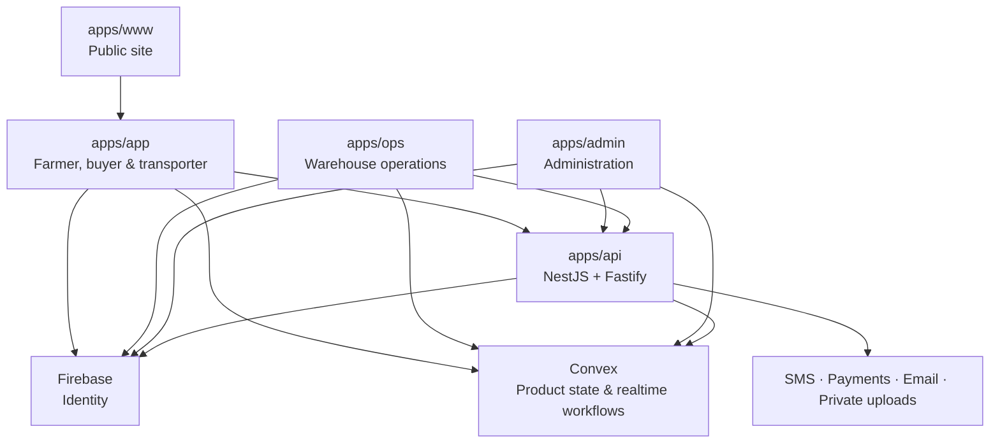

# Technical overview

## Purpose

Kuapa Dwaso is a pnpm and Turborepo monorepo for a warehouse-based agricultural produce platform. The architecture separates lightweight public and farmer-facing experiences from operational consoles and external-provider code. This protects low-bandwidth users, keeps responsibilities clear, and prevents the API from becoming a duplicate product database.

## System at a glance



## Application boundaries

| Area         | Responsibility                                                                                                                                |
| ------------ | --------------------------------------------------------------------------------------------------------------------------------------------- |
| `apps/www`   | Lightweight public marketing and education site. It must not import the operational dashboard package or provider SDK logic.                  |
| `apps/app`   | Authenticated self-service for farmers, buyers, and transporters.                                                                             |
| `apps/ops`   | Warehouse-agent flows: farmer assistance, intake, receipt lookup, inventory changes, and dispatch preparation.                                |
| `apps/admin` | Platform configuration, access control, oversight, reporting, finance, disputes, and audits.                                                  |
| `apps/api`   | NestJS/Fastify provider and webhook boundary for authentication verification, invitations, SMS, payments, uploads, and external integrations. |
| `convex`     | System of record for product state, realtime queries, mutations, and workflow rules.                                                          |
| `packages`   | Shared UI, dashboard UI, tokens, types, validators, permissions, configuration, utilities, SMS behavior, and tooling.                         |

The top-level `apps/`, `packages/`, `convex/`, and `docs/` folders are intentional architecture boundaries. See [ADR-0001](../decisions/ADR-0001-monorepo-and-app-boundaries.md) and [ADR-0002](../decisions/ADR-0002-operations-app-and-warehouse-domain.md).

## Data and workflow ownership

Convex is the product system of record. It owns warehouses, warehouse agents, farmers, buyers, transporters, inventory batches and reservations, recurring market-service schedules, dated market-delivery runs, storage-fee ledgers, fee rules, buyer orders and charges, sales and deductions, dispatches, notifications, disputes, audit logs, and settings.

The API calls provider SDKs and receives provider webhooks. It validates and translates those interactions into product workflow updates, but it must not hold a competing workflow database. Firebase supplies identity; it is not the warehouse data store.

The core domain vocabulary is:

```text
warehouse · warehouse_agent · inventory_batch · storage_receipt
storage_fee_ledger · buyer_order · sale_record · dispatch
```

Schedules express a recurring service promise, runs snapshot one dated
occurrence, and dispatches record physical movement. These records are not
collapsed. Buyer orders bind to a run before cutoff, while operations teams aggregate
quantities by compatible crop and unit only.

State transitions are centrally constrained in the shared permissions package. This keeps inventory, order, payment, run, and dispatch changes explicit and helps prevent invalid transitions such as dispatching unreserved stock.

## Integrations

| Integration               | Role                                                               | Boundary                                                                                   |
| ------------------------- | ------------------------------------------------------------------ | ------------------------------------------------------------------------------------------ |
| Firebase                  | Browser authentication and server-side token verification          | Client apps use public web configuration; the API verifies tokens with server credentials. |
| Convex                    | Product database, queries, mutations, realtime state               | Shared product state lives here.                                                           |
| Arkesel or mock SMS       | One-way transactional and notification delivery                    | API-only provider adapter; local development can use `SMS_PROVIDER=mock`.                  |
| Paystack or mock payments | Buyer payment initialization, verification, and webhook processing | API-only provider adapter; local development can use `PAYMENT_PROVIDER=mock`.              |
| Resend or mock email      | Invitation and buyer email delivery                                | API-only provider adapter.                                                                 |
| Cloudflare R2             | Private evidence and upload storage                                | API issues short-lived signed upload and read URLs; no public bucket is used.              |

## Security and privacy

- Firebase ID tokens are verified on protected API routes.
- Roles and scoped permissions are centralized in `packages/permissions` and enforced in product workflows.
- Admin access supports email/manual-link invitations, scoped roles, groups, effective-permission review, and multi-factor authentication flows. Account invitation links are never sent by SMS.
- Provider credentials, webhook secrets, and Firebase Admin credentials stay server-side. Only `NEXT_PUBLIC_*` browser configuration is exposed to clients.
- Sensitive operational activity is auditable; disputes and evidence provide an exception path.
- Private upload storage is accessed through signed URLs rather than public object URLs.
- API CORS is configured from allowed origins, and integration routes use defensive validation and rate limits.

## Local development

1. Use Node.js 22+ and enable Corepack.
2. Copy `.env.example` to the root `.env.local` and fill in only the values appropriate for local development.
3. Run `corepack pnpm install`.
4. Run `corepack pnpm convex:dev`, then set `NEXT_PUBLIC_CONVEX_URL` to the emitted `CONVEX_URL`.
5. Start the required surface with `corepack pnpm dev:www`, `dev:app`, `dev:ops`, `dev:admin`, or `dev:api`.

Root `.env.local` is the primary local configuration file. The app-local files are optional overrides. Run `corepack pnpm env:check-next-public` to verify browser configuration presence without printing its values.

## Delivery and deployment

The repository includes a shared multi-stage Dockerfile and Kustomize manifests for staging and production. Deployment is designed around Kubernetes, Cloudflare Tunnel as the public ingress path, and Infisical-managed runtime secrets. Full instructions are in the [deployment runbook](../deployment/kubernetes-cloudflare-infisical.md).

Before a full-repository change is handed off, run:

```bash
corepack pnpm list --depth -1
git status --short
```

## Further reading

- [Architecture notes](../architecture/README.md)
- [Repository structure convention](../conventions/repo-structure.md)
- [Backend structure convention](../conventions/backend-structure.md)
- [Network-performance convention](../conventions/network-performance.md)
- [Authentication, onboarding, invitations, and uploads](../conventions/auth-onboarding-invites-uploads.md)
